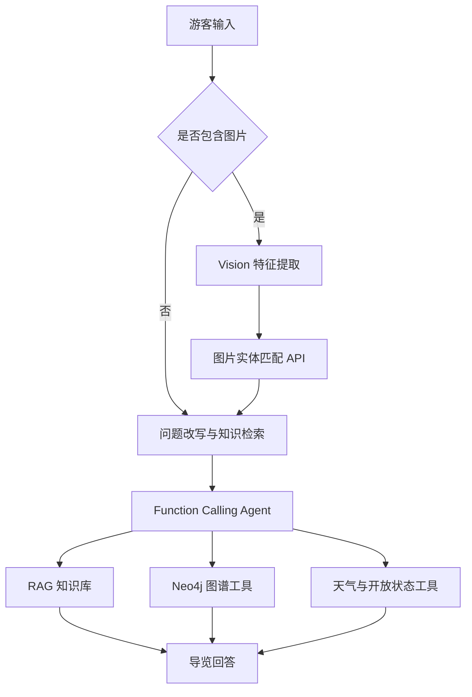

# Scenic Agent：陈家祠智能导览助手

<p align="center">基于大语言模型、RAG、知识图谱与多模态识别的文化景区智能导览 Agent</p>

<p align="center">
  <a href="https://udify.app/chat/G1lXUZh9LgrQ0AsT"><strong>🌐 Online Demo</strong></a> ·
  <a href="#系统架构"><strong>Architecture</strong></a> ·
  <a href="#核心功能"><strong>Features</strong></a> ·
  <a href="#roadmap"><strong>Roadmap</strong></a>
</p>

---

## 📌 Overview

**Scenic Agent** 是一个面向文化旅游场景的智能导览项目，目前以广东民间工艺博物馆（陈家祠）为应用对象。项目尝试解决传统景区问答中知识来源分散、实体关系难以表达、实时信息容易过期，以及图片识别结果难以继续讲解等问题。

系统采用“**知识库负责文本事实、知识图谱负责实体关系、专用 API 负责实时与结构化查询、Agent 负责工具调度和回答生成**”的协作方式，为游客提供景区历史、建筑艺术、馆藏展品、票务规则、开放状态、天气和参观建议等服务。

> [!IMPORTANT]
> 当前文字导览主链路已具备基础可用性；图片实体识别仍处于实验和持续优化阶段。在线 Demo 的回答仅供导览参考，临时闭馆、票务和活动信息请以景区官方公告为准。

## 🚀 Online Demo

### [👉 打开陈家祠智能导览助手](https://udify.app/chat/G1lXUZh9LgrQ0AsT)

无需安装即可体验。推荐问题：

```text
陈家祠有哪些值得重点看的建筑装饰？
聚贤堂在陈家祠中有什么作用？
第一次参观陈家祠，应该怎么安排路线？
明天陈家祠开放吗？天气适合参观吗？
```

也可以上传景区建筑装饰或馆藏展品图片，体验实验性的图片实体匹配与后续讲解。

## ✨ 核心功能

| 能力 | 说明 | 主要数据或工具 |
| --- | --- | --- |
| 景区知识问答 | 回答历史、建筑、工艺、馆藏和参观服务问题 | RAG 知识库 |
| 实体关系查询 | 查询景点、厅堂、展品、工艺及空间之间的关系 | Neo4j + FastAPI |
| 开放状态查询 | 根据日期、星期、闭馆规则和例外信息判断开放状态 | 专用 API |
| 实时天气查询 | 获取天气并辅助判断参观条件 | 天气 API |
| 个性化导览 | 根据时间、兴趣和同行人员生成参观建议 | Agent + 知识库 |
| 多轮对话 | 结合上下文理解省略、追问和连续咨询 | Dify Workflow |
| 图片实体识别 | 从图片提取名称、工艺和视觉特征，匹配图谱实体 | Vision LLM + `/image-match` |
| 室内路线查询 | 基于空间节点及其相邻关系查询路径 | Neo4j + `/indoor-route` |

## 🧠 Method

与仅依赖单一大模型直接回答不同，本项目根据问题类型选择知识来源：

1. **自然语言理解**：识别用户意图、上下文和约束条件。
2. **检索增强生成**：从结构化景区知识库中召回相关事实。
3. **知识图谱查询**：处理实体定位、属性和关系类问题。
4. **工具调用**：开放状态、天气和路线等问题交由专用服务计算或查询。
5. **多模态匹配**：将图片转换为候选名称、视觉关键词和工艺类型，再与图谱中的可识别实体进行多维评分。
6. **回答生成**：Agent 汇总检索证据，生成自然、清晰且适合游客阅读的中文回答。

图片匹配阶段综合使用名称、别名、视觉关键词、视觉描述、识别提示和工艺类别等信号，并通过同义词归一化、组合特征奖励及低视觉特征降权减少同类实体混淆。

## 🏗️ 系统架构



### 模块分工

| 模块 | 职责 |
| --- | --- |
| Dify | 对话入口、工作流编排、变量传递、知识检索和 Agent 调度 |
| LLM / Vision LLM | 问题理解、视觉特征提取、工具选择和自然语言生成 |
| RAG 知识库 | 保存景区历史、建筑艺术、馆藏、票务和服务规则等文本事实 |
| Neo4j | 保存实体、属性、空间结构及实体之间的关系 |
| FastAPI | 封装图谱检索、图片匹配、室内路线、天气和开放状态接口 |
| Render | 承载云端 API 服务及相关部署 |

## 🔄 Agent Workflow

### 文字问答

```text
用户问题 → 检索问题改写 → RAG 召回 → Agent 判断是否调用工具 → 证据整合 → 最终回答
```

当问题涉及实时天气、指定日期是否开放、实体关系或室内路线时，Agent 会优先调用对应工具，而不是依赖模型记忆。

### 图片问答

```text
用户图片 → Vision 提取候选名称/视觉关键词/工艺
         → /image-match 检索并评分
         → 返回 Top-K 与最佳实体
         → 知识检索和图谱查询
         → 生成展品或建筑装饰讲解
```

当匹配证据不足时，系统应保留不确定性，而不是强行把图片归入某个实体。

## 🔌 API Design

| Endpoint | Method | Description |
| --- | --- | --- |
| `/health` | `GET` | 检查 API 与图数据库连接状态 |
| `/entity` | `GET` | 根据实体名称、别名或 ID 进行模糊检索 |
| `/vision-entity` | `POST` | 根据视觉模型给出的候选名称查询实体及关系 |
| `/image-match` | `POST` | 综合名称、视觉关键词和工艺对图片候选实体评分 |
| `/indoor-route` | `GET` | 查询两个空间节点之间的最短室内路径 |

服务通过环境变量读取数据库连接信息：

```bash
NEO4J_URI=<your-neo4j-uri>
NEO4J_USERNAME=<your-neo4j-username>
NEO4J_PASSWORD=<your-neo4j-password>
```

> 请勿将真实的 Neo4j、模型或天气 API 凭据提交到 GitHub。部署时应在平台的 Environment Variables / Secrets 中配置。

## 📂 Repository Structure

当前仓库以项目说明和协作文档为主：

```text
scenic-agent/
├── README.md              # 项目主页
├── Git使用说明书.md        # Git/GitHub 协作说明
└── 开源平台分工.pdf        # 项目任务与成员分工
```

后续代码与配置公开后，建议按以下结构维护：

```text
scenic-agent/
├── api/                   # FastAPI 与 Neo4j 工具服务
├── workflow/              # Dify 工作流 DSL 与 Prompt
├── data/                  # Schema、示例数据及数据说明
├── docs/                  # 搭建、部署、测试和效果分析文档
├── assets/                # README 与文档图片
├── tests/                 # API、检索及端到端回归测试
├── .env.example           # 环境变量示例（不含真实密钥）
└── README.md
```

## ⚡ Quick Start

### 1. 直接体验

访问 [Online Demo](https://udify.app/chat/G1lXUZh9LgrQ0AsT)，输入文字问题或上传图片即可。

### 2. 获取项目资料

```bash
git clone https://github.com/kloaria/scenic-agent.git
cd scenic-agent
```

当前公开仓库尚未包含完整可独立部署的工作流、后端代码和数据文件，因此暂不提供本地一键启动命令。相关内容整理完成后，将补充依赖安装、Dify DSL 导入、Neo4j 数据导入和 FastAPI 部署说明。

## 📊 当前效果

- 文字问答测试覆盖直接查询、多问题联合回答和上下文记忆等场景，共 **19 个分项**；一期测试中主链路整体运行正常。
- 系统能够针对知识库事实生成层次清晰、较自然的游客导览回答。
- 开放状态、天气和实体关系问题可由 Agent 路由至对应工具。
- 图片识别专项测试暴露出候选召回、特征归一化、同类实体区分和节点衔接等问题，当前不将其描述为成熟能力。

上述结果来自一期功能测试，样本规模仍有限，不能等同于完整准确率评测。后续将建立固定回归集，并报告 Top-1 准确率、Top-3 召回率、低置信拒识率、端到端成功率和平均响应时间。

## ⚠️ 项目进展与局限

- 图片视觉关键词与图谱字段格式不完全统一；
- 工艺类别可能使多个同类实体获得接近的分数；
- 视觉同义词和部分馆藏工艺词覆盖不足；
- 正确实体可能因数据覆盖不足而未进入候选集；
- 多个模型节点、知识检索和云端服务冷启动会增加响应时间；
- 临时展览、活动和最新服务规则仍需要持续更新与官方核验。

## 🗺️ Roadmap

- [x] 搭建 Dify 导览工作流
- [x] 接入景区 RAG 知识库
- [x] 构建 Neo4j 实体关系查询能力
- [x] 封装开放状态、天气、实体和路线工具
- [x] 完成图片特征提取与实体匹配原型
- [ ] 公开 Dify Workflow DSL、Prompt 与 FastAPI 源码
- [ ] 统一视觉关键词字段并扩充同义词图谱
- [ ] 建立图片识别固定回归测试集
- [ ] 引入展品真实图片库和向量检索
- [ ] 融合展厅位置、拍摄方向和多张图片证据
- [ ] 完善日志、缓存、监控和服务降级机制

## 🔒 Data and Privacy

- 不提交 `.env`、访问令牌、数据库密码或第三方 API Key；
- 对数据来源、图片版权和使用范围进行核验；
- 对游客上传的图片设置合理的保存、访问和删除策略；
- 对票务、开放时间等时效性信息标注来源与更新时间。

## 🤝 Contributing

欢迎通过 [Issues](https://github.com/kloaria/scenic-agent/issues) 提交问题、测试样例和改进建议，也欢迎围绕以下方向贡献：

- 景区知识库清洗与事实核验；
- Neo4j Schema、Cypher 查询与实体消歧；
- 图片匹配、视觉同义词与多模态检索；
- Dify 工作流稳定性和响应延迟优化；
- API 测试、端到端评测与部署文档。

提交代码前请确保不包含任何真实密钥或未获授权的数据。

## 📝 Citation

如果本项目对你的课程设计、研究或开发工作有帮助，可以引用本仓库：

```bibtex
@software{scenic_agent_2026,
  title  = {Scenic Agent: An LLM-, RAG-, and Knowledge-Graph-Based Tour Guide for Chen Clan Ancestral Hall},
  author = {Scenic Agent Contributors},
  year   = {2026},
  url    = {https://github.com/kloaria/scenic-agent}
}
```

## 📄 License

当前仓库尚未添加开源许可证。在许可证明确之前，仓库内容默认不代表已授权自由复制、修改或再分发。如计划开放代码，建议根据数据来源和项目要求选择合适的许可证，并在根目录添加 `LICENSE` 文件。

## 🙏 Acknowledgements

本项目使用或参考了 Dify、FastAPI、Neo4j、大语言模型、视觉语言模型及第三方天气服务等技术与平台。感谢相关开源社区和项目参与者。

---

<p align="center">
  <a href="https://udify.app/chat/G1lXUZh9LgrQ0AsT">Online Demo</a> ·
  <a href="https://github.com/kloaria/scenic-agent/issues">Report an Issue</a>
</p>
